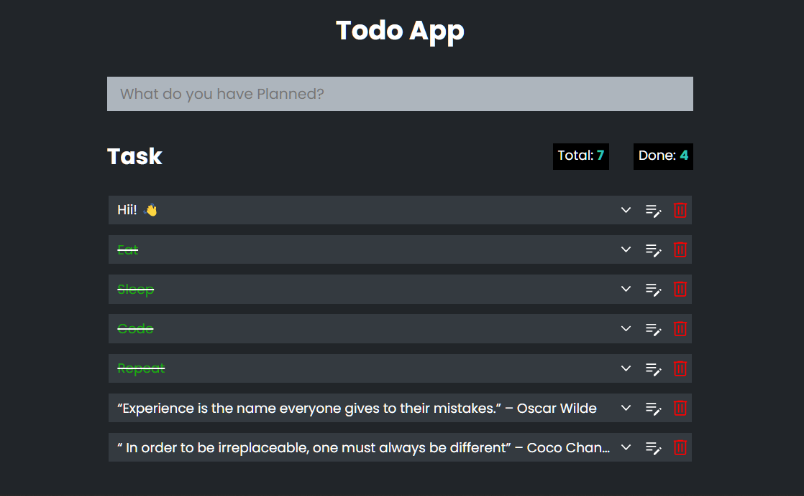

# Todo Web App

This is a simple todo web app
This is a simple todo web app. I've, made this project while learning JavaScript.

## Features

- Create, Read, Update, Delete (CRUD)
- You can mark your Task as done
- It uses Web Storage API to store data 

## Screenshots

## Tech Stack

HTML, CSS, JavaScript

[Live Link](https://todolist-app-js.vercel.app/)

## Feedback

If you have any feedback, please reach out to us at [findCoder](https://www.findcoder.io/u/amansingh)

